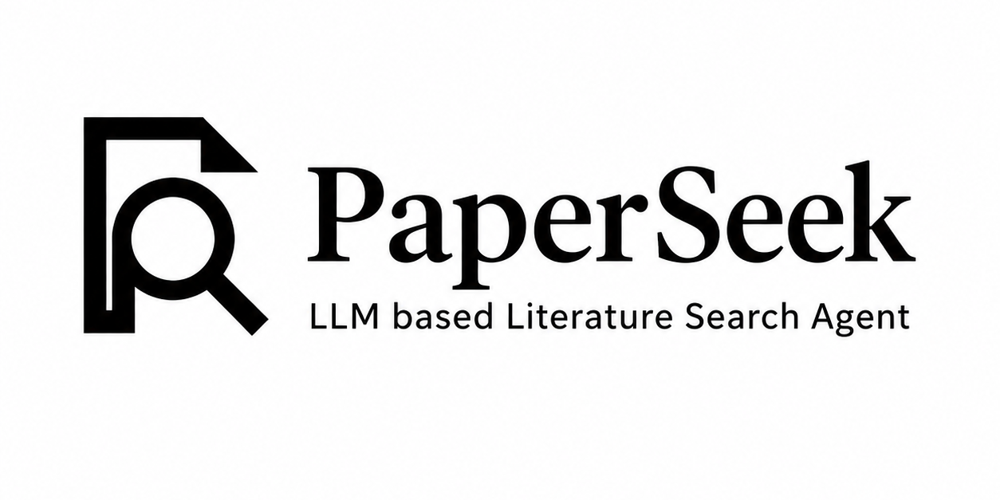
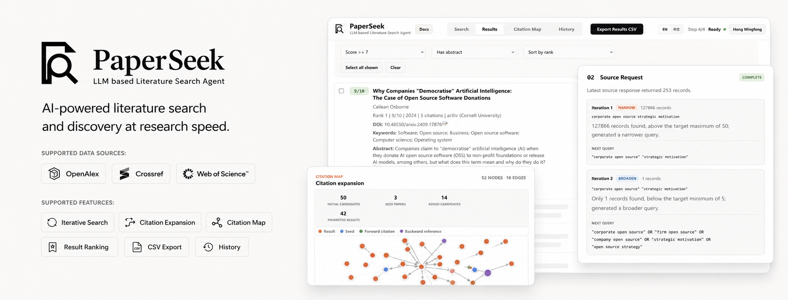
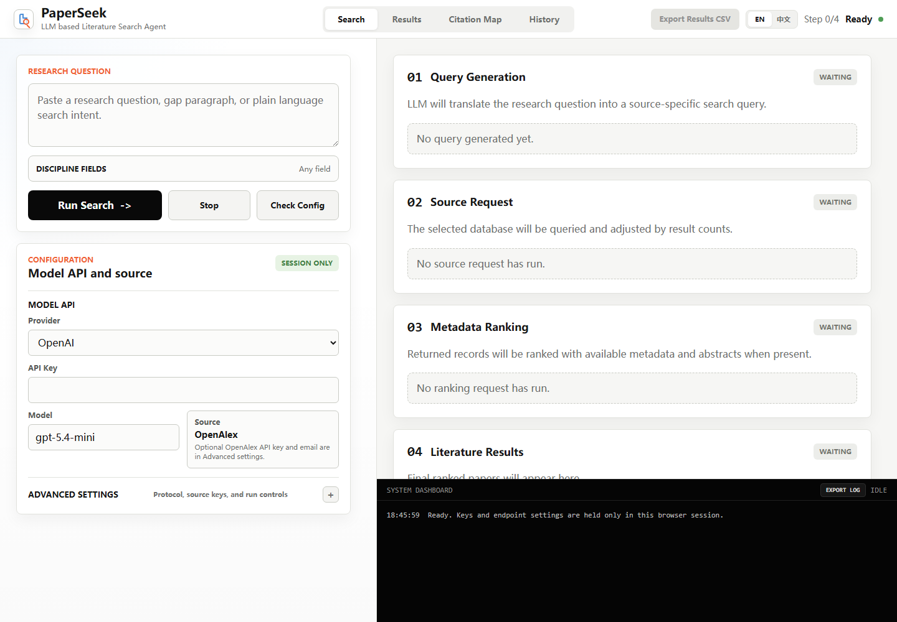

<p align="center">
  
</p>

<p align="center">
  <strong>AI-powered literature search and discovery at research speed.</strong>
</p>

<p align="center">
  Describe a research question once. PaperSeek generates database queries, calibrates result counts, expands citation links, ranks candidate papers, and exports a reviewable paper list.
  <br>
  An open-source literature-search workflow for topic exploration, reviews, interdisciplinary discovery, and daily paper tracking.
</p>

<p align="center">
  <a href="https://www.paperseek.xyz/">Online</a>
  ·
  <a href="https://docs.paperseek.xyz/">Docs</a>
  ·
  <a href="https://modelscope.cn/studios/HongMingfeng/PaperSeek">ModelScope Studio</a>
  ·
  <a href="https://modelscope.cn/learn/434408">Community Article</a>
  ·
  <a href="https://modelscope.cn/skills/HongMingfeng/paperseek">Skill</a>
</p>

<p align="center">
  <a href="https://www.python.org/"></a>
  <a href="https://pypi.org/project/paperseek/"></a>
  <a href="LICENSE"></a>
  <a href="https://github.com/MingfengHong/paperseek/actions/workflows/ci.yml"></a>
  <a href="#project-status"></a>
  <a href="https://modelscope.cn/studios/HongMingfeng/PaperSeek"></a>
</p>

<p align="center">
  
</p>

<p align="center">
  <strong>Language:</strong>
  <a href="README.md">简体中文</a>
  ·
  English
</p>

## Why PaperSeek

The hard part of literature search is often not finding papers at all. It is knowing whether your search is complete and accurate when synonyms, disciplinary boundaries, and database-specific query rules all collide. PaperSeek turns an imprecise research intent into an executable, observable, and revisitable search workflow.

PaperSeek is built for first-pass paper discovery and metadata organization. It does not replace systematic review protocols, full-text access, copyright checks, or expert judgement.

## What PaperSeek Does

- **Understands research questions**: generate source-specific queries for OpenAlex, Crossref, or WoS Starter from Chinese or English input.
- **Calibrates search strings**: broaden or narrow queries according to target result counts, with 5 iterations by default.
- **Builds structured candidate sets**: normalize title, authors, venue, year, DOI, abstract, citation count, keywords, and links.
- **Ranks with reasons**: ask an LLM to score candidates and explain each score briefly.
- **Expands citation networks**: add references and citing works from high-matching OpenAlex records, then inspect them in Citation Map.
- **Limits by discipline**: select OpenAlex Fields in the Web UI or CLI; OpenAlex uses native field filters, WoS maps them to WC categories, and Crossref uses them as query context.
- **Keeps the process reviewable**: inspect workflow stages, ranked results, citation maps, local history, and CSV exports in the Web UI.

## Choose Your Path

- **Hosted online edition**: use [paperseek.xyz](https://www.paperseek.xyz/) with Quick Start, ModelScope Service, or Use your own API; see the [hosted demo guide](docs/online-demo.md).
- **Self-hosted open-source edition**: install from PyPI or source, or run with Docker/VPS for longer searches, citation expansion, and heavier request volume.
- **ModelScope Studio**: use the public [PaperSeek Studio](https://modelscope.cn/studios/HongMingfeng/PaperSeek) or deploy your own Docker Studio from the guide.
- **Agent Skill**: copy `skills/paperseek/` into a skill-aware agent platform; the Skill includes a lightweight runtime for core search without installing the full package.
- **MCP Server**: install `paperseek[mcp]` and run `paperseek-mcp` to expose literature search, diagnostics, and history as MCP tools for MCP-compatible AI agents.

Full Chinese user manual: [PaperSeek User Manual](docs/user-manual.md); deployment guide: [Docker, Vercel, and ModelScope deployment](docs/deployment.md).

## Quick Start

Install the stable release from PyPI:

```bash
python -m venv .venv
source .venv/bin/activate
python -m pip install --upgrade pip
python -m pip install paperseek
```

Windows PowerShell:

```powershell
python -m venv .venv
.\.venv\Scripts\Activate.ps1
python -m pip install --upgrade pip
python -m pip install paperseek
```

You can also clone the repository and install from source when you want to inspect or edit the code:

```bash
git clone https://github.com/MingfengHong/paperseek.git
cd paperseek
python -m venv .venv
source .venv/bin/activate
python -m pip install --upgrade pip
python -m pip install -e .
```

Windows PowerShell:

```powershell
git clone https://github.com/MingfengHong/paperseek.git
cd paperseek
python -m venv .venv
.\.venv\Scripts\Activate.ps1
python -m pip install --upgrade pip
python -m pip install -e .
```

Start the Web UI:

```bash
paperseek-web
```

Open:

```text
http://127.0.0.1:8765/
```

You can also run a search directly from the CLI:

```bash
paperseek "open innovation and digital platforms" --source openalex
```

## Deployment

Docker is the recommended path for the full Web UI:

```bash
docker compose up --build
```

Open:

```text
http://127.0.0.1:8765/
```

Vercel can host quick demos and lightweight Web UI deployments:

[](https://vercel.com/new/clone?repository-url=https%3A%2F%2Fgithub.com%2FMingfengHong%2Fpaperseek)

ModelScope Studio can also deploy PaperSeek as a Docker Studio. Use this button to fork the official Studio and create your own copy:

<a href="https://modelscope.cn/studios/fork?target=HongMingfeng/PaperSeek"></a>

For long searches, citation expansion, and heavy repeated use, prefer Docker or a VPS. See the [deployment guide](docs/deployment.md) for details.

## Minimal Configuration

PaperSeek needs at least one LLM provider. OpenAlex is the default data source. Anonymous OpenAlex access is enough for quick tests, but a free API key is recommended for more stable use.

DeepSeek example:

```bash
export LLM_PROVIDER=deepseek
export LLM_API_TYPE=openai_chat
export LLM_MODEL=deepseek-v4-flash
export LLM_BASE_URL=https://api.deepseek.com
export LLM_API_KEY=your-llm-api-key
paperseek-web
```

CSTCloud example:

```bash
export LLM_PROVIDER=cstcloud
export LLM_API_TYPE=openai_chat
export LLM_MODEL=DeepSeek-V4-Flash
export LLM_BASE_URL=https://uni-api.cstcloud.cn/v1
export LLM_API_KEY=your-cstcloud-api-key
paperseek-web
```

ModelScope API-Inference example:

```bash
export LLM_PROVIDER=modelscope
export LLM_API_TYPE=openai_chat
export LLM_MODEL=Qwen/Qwen3-235B-A22B-Instruct-2507
export LLM_BASE_URL=https://api-inference.modelscope.cn/v1
export LLM_API_KEY=your-modelscope-token
paperseek-web
```

Windows PowerShell:

```powershell
$env:LLM_PROVIDER = "deepseek"
$env:LLM_API_TYPE = "openai_chat"
$env:LLM_MODEL = "deepseek-v4-flash"
$env:LLM_BASE_URL = "https://api.deepseek.com"
$env:LLM_API_KEY = "your-llm-api-key"
paperseek-web
```

Local Ollama does not require an LLM API key:

```bash
export LLM_PROVIDER=ollama
export LLM_API_TYPE=openai_chat
export LLM_MODEL=qwen3:8b
export LLM_BASE_URL=http://127.0.0.1:11434/v1
paperseek-web
```

The repository includes `.env.example`. Copy it to `.env` for local reference, but never commit real API keys. The CLI and Web backend automatically load `.env` from the current directory or project root; existing system environment variables take precedence.

## Web UI

The Web UI has four main workspaces:

| View | Purpose |
| --- | --- |
| Search | Enter the research question, choose Discipline Fields, configure data source, LLM, iterations, and target result range; watch workflow stages and system logs. |
| Results | Review ranked papers, search, filter, sort, select, and export paper CSV. |
| Citation Map | Explore OpenAlex citation expansion as a directed graph. |
| History | Review locally saved runs, final queries, ranked records, and run events. |



If API keys are already configured through system environment variables or `.env`, the Web UI shows that the environment is configured without sending secret values to the browser. API keys, base URLs, and run parameters entered in the Web UI are used only for the current browser session and are not written to local config files by PaperSeek. Local history saves run summaries, queries, events, and results, but never raw API keys.

CSV files exported from Results use the research-question theme and local date in the filename.

## CLI Usage

Basic search:

```bash
paperseek "responsible AI governance in public sector" --source openalex
```

Explicit subcommand:

```bash
paperseek search "digital platforms and open innovation" --source openalex
```

JSON output:

```bash
paperseek search "open innovation" --source openalex --output json
```

Common options:

```bash
paperseek search "your research question" \
  --source openalex \
  --field management \
  --discipline "Computer Science" \
  --min 5 \
  --max 50 \
  --iterations 5 \
  --llm-provider deepseek \
  --llm-api-type openai_chat \
  --llm-model deepseek-v4-flash \
  --llm-base-url https://api.deepseek.com \
  --llm-key your-llm-api-key
```

Run diagnostics:

```bash
paperseek doctor
paperseek doctor --source openalex --json
```

Run a minimal real data-source request:

```bash
paperseek smoke --source openalex --query "machine learning"
paperseek smoke --source crossref --query "open innovation" --json
```

List source capabilities:

```bash
paperseek sources
paperseek sources --json
```

Review local history:

```bash
paperseek history list
paperseek history show <RUN_ID> --json
paperseek history path
```

Manage user-level CLI config:

```bash
paperseek config path
paperseek config set LLM_API_KEY your-llm-api-key
paperseek config list
paperseek config unset LLM_API_KEY
```

Environment variables override user-level config. `paperseek config list` masks secret values.

Discipline Fields accept OpenAlex Field IDs, labels, or `https://openalex.org/fields/<id>` URLs. Pass multiple fields by repeating `--discipline` / `--discipline-field`, or separate environment values with semicolons:

```bash
export DISCIPLINE_FIELDS="17;14"
paperseek search "open innovation and digital platforms" --source openalex
```

`--field` / `SEARCH_FIELD` is a free-text field hint that mainly guides LLM query generation; `--discipline` / `DISCIPLINE_FIELDS` is a structured discipline constraint. OpenAlex applies `primary_topic.field.id` filtering, WoS Starter maps selections to `WC=` categories, and Crossref uses the selected disciplines as query context because it does not expose the same shared taxonomy.

## Data Sources

| Source | Default status | API key | Best for | Notes |
| --- | --- | --- | --- | --- |
| OpenAlex | Default | Recommended | Precise search, abstracts, citation counts, citation expansion, citation maps | Open scholarly metadata source for broad discovery and citation exploration. |
| Crossref | Supported | Usually not required | DOI checks, publication metadata, journal and publisher validation | DOI and metadata registry; useful for metadata verification and DOI completion. |
| Web of Science Starter | Adapter retained | Required | Users with approved Clarivate API access | Commercial database API; availability and returned fields depend on subscription and institutional entitlement. |

## LLM Providers

PaperSeek supports two mainstream API protocol families: OpenAI-style APIs and Anthropic Messages API. Provider selects service defaults; API Type selects request format.

| Provider | Default API Type | Default model |
| --- | --- | --- |
| OpenAI | `openai_responses` | `gpt-5.4-mini` |
| Anthropic | `anthropic_messages` | `claude-sonnet-4-6` |
| Google Gemini | `openai_chat` | `gemini-3.5-flash` |
| DeepSeek | `openai_chat` | `deepseek-v4-flash` |
| CSTCloud | `openai_chat` | `DeepSeek-V4-Flash` |
| DashScope | `openai_chat` | `qwen3.6-plus` |
| Kimi Moonshot | `openai_chat` | `kimi-k2.6` |
| Zhipu AI GLM | `openai_chat` | `glm-5.1` |
| SiliconFlow | `openai_chat` | `deepseek-ai/DeepSeek-V4-Flash` |
| OpenRouter | `openai_chat` | `openai/gpt-5.4-mini` |
| Volcengine Ark | `openai_chat` | `doubao-seed-2-0-mini-260428` |
| Tencent Hunyuan | `openai_chat` | `hunyuan-turbos-latest` |
| Baidu Qianfan | `openai_chat` | `ernie-5.0` |
| ModelScope | `openai_chat` | `Qwen/Qwen3-235B-A22B-Instruct-2507` |
| Ollama | `openai_chat` | `qwen3:8b` |
| Custom | `openai_chat` | Empty; fill in your own model |

Default models initialize forms and examples. Actual availability depends on provider accounts, regions, billing, and compatibility layers.

CSTCloud provides an OpenAI API Compatible LLM endpoint. The Base URL is `https://uni-api.cstcloud.cn/v1`. PaperSeek's provider id is `cstcloud`, and its default model is `DeepSeek-V4-Flash`. To get a key, open [CSTCloud API Keys](https://uni-api.cstcloud.cn/api_keys), sign in with CSTCloud unified authentication, and submit the requested application information. Chinese Academy of Sciences intramural users can sign in with a CSTCloud Pass, usually their institutional email account and password. See the [CSTCloud LLM API manual](https://uni-api.cstcloud.cn/doc/llm/) for endpoint details.

## Workflow

A search usually has four stages:

1. **Query Generation**: the LLM creates an initial query from the research question, optional Field Hint, and Discipline Fields.
2. **Source Search**: PaperSeek requests OpenAlex, Crossref, or WoS Starter and logs HTTP status and hit counts.
3. **Query Refinement**: if the hit count is too low or too high, the LLM adjusts the query and continues.
4. **Ranking & Results**: the candidate pool is scored by the LLM, and the top records are returned.

When OpenAlex citation expansion is enabled, PaperSeek selects high-matching seed papers, adds references and citing works, then ranks the complete candidate pool. The current default maximum output is 50 papers.

Large candidate pools are ranked in concurrent LLM batches. The default batch size is `8` and default concurrency is `4`; above 32 candidates, PaperSeek adapts the batch size to keep the total batch count near the concurrency level. If one ranking batch fails, only that batch falls back to zero-score source order instead of failing the whole search.

## Citation Map

Citation Map uses arrows for citation direction:

```text
A -> B means A cites B
```

Graph nodes come from final results and OpenAlex citation expansion records. You can drag nodes, zoom and pan the canvas, and inspect node details. The citation map is useful for finding classic works, adjacent topics, and recent follow-up papers that keyword search may miss.

## Environment Variables

| Variable | Description |
| --- | --- |
| `DATA_SOURCE` | `openalex`, `crossref`, or `wos`; default is `openalex`. |
| `LLM_PROVIDER` | LLM provider, such as `openai`, `deepseek`, `cstcloud`, `anthropic`, `modelscope`, or `ollama`. |
| `LLM_API_TYPE` | `openai_responses`, `openai_chat`, or `anthropic_messages`. |
| `LLM_MODEL` | Model name. |
| `LLM_BASE_URL` | API base URL. |
| `LLM_API_KEY` | LLM API key; optional for Ollama. |
| `OPENALEX_API_KEY` | OpenAlex API key, recommended. |
| `OPENALEX_EMAIL` | OpenAlex contact email. |
| `CROSSREF_EMAIL` | Crossref polite pool email. |
| `WOS_API_KEY` | Clarivate Web of Science Starter API key. |
| `WOS_DB` | WoS database code, default `WOS`. |
| `SEARCH_FIELD` | Free-text discipline or field hint. |
| `DISCIPLINE_FIELDS` | OpenAlex Field IDs, labels, or URLs; use semicolons for multiple values and map selections to OpenAlex / WoS discipline filters. |
| `TARGET_MIN` / `TARGET_MAX` | Target result count range. |
| `MAX_ITERATIONS` | Maximum query refinement iterations. |
| `EXPAND_CITATIONS` | Enable OpenAlex citation expansion; default `true`. |
| `FETCH_ABSTRACTS` | Try external DOI metadata for abstracts; default `false`. |
| `CITATION_SEED_COUNT` | Number of seed papers used for citation expansion. |
| `CITATION_PER_SEED` | Number of citation neighbors fetched per seed. |
| `CITATION_MAX_RECORDS` | Candidate cap for citation expansion. |
| `RANKING_BATCH_SIZE` | LLM ranking batch size, default `8`; large candidate pools adapt the batch size to reduce batch count. |
| `RANKING_CONCURRENCY` | LLM ranking concurrency, default `4`; one failed batch no longer fails the whole search. |
| `LLM_TIMEOUT_SECONDS` | Per-request LLM timeout in seconds, default `180`, minimum `30`. |
| `PAPERSEEK_HISTORY_ENABLED` | Enable local history; default `true`. |
| `PAPERSEEK_TIMEZONE` | Timezone for local history timestamps; default `Asia/Shanghai`. The Web UI prefers the detected browser timezone. |
| `PAPERSEEK_DATA_DIR` | Local PaperSeek data directory; default `~/.paperseek`. |
| `PAPERSEEK_HISTORY_DB` | Local history SQLite path; default `~/.paperseek/paperseek.db`. |

## Getting API Access

### OpenAlex

OpenAlex supports anonymous access, but a free API key is recommended:

1. Open [OpenAlex](https://openalex.org/) and create an account.
2. Visit [OpenAlex API settings](https://openalex.org/settings/api).
3. Copy the API key.
4. Fill `OpenAlex API Key` in the Web UI or set `OPENALEX_API_KEY`.

### Crossref

Crossref REST API usually does not require an API key. Set a contact email to enter the polite pool:

```bash
export CROSSREF_EMAIL=you@example.org
```

For higher quotas, priority support, or production SLA, consider Crossref Metadata Plus. PaperSeek uses the public or polite REST API path.

### Web of Science Starter API

WoS Starter requires approval in Clarivate Developer Portal and usually fits users with institutional Web of Science access:

1. Open the [Clarivate Developer Portal signup page](https://developer.clarivate.com/signup) and register.
2. Prefer an institutional email and, if possible, use the same identity as your Web of Science account.
3. Go to [Applications](https://developer.clarivate.com/applications) and click `Register Application`.
4. Fill application metadata:
   - `Application ID` should use digits, lowercase letters, `-`, or `_`.
   - `Application Name` can be your institution or project name.
   - `Application Description` can mention Web of Science API search.
   - Keep `Client Type` as `Public: Single Page Application`.
   - Do not enable OAuth2.0 flows.
5. Open [Web of Science Starter API](https://developer.clarivate.com/apis/wos-starter).
6. Select the registered application and click `Subscribe`.
7. Choose the plan that matches your identity and institutional entitlement.
8. Wait for approval after `Subscription approval is pending`.
9. After receiving the API key, fill `WoS API Key` in the Web UI or set `WOS_API_KEY`.

WoS Starter limits, fields, and availability depend on plan and institutional entitlement. For HTTP 401, check HTTPS and the key. For Clarivate's non-standard HTTP 512, check Clarivate service status, subscription approval, and query compatibility.

## Python API and Core

The community package includes the reusable `paperseek_core` module directly, so users do not need to install a separate `paperseek-core` repository dependency. Regular users and downstream code should import the stable public entry point from `paperseek`:

```python
from paperseek import PaperSeekAgent
```

`LiteratureSearchAgent` and `WosSearchAgent` remain as backward-compatible aliases. New code should use `PaperSeekAgent`.

## Agent Skill

The repository includes an optional PaperSeek Skill:

```text
skills/paperseek/
```

It teaches skill-aware AI agents how to call PaperSeek, choose data sources, run diagnostics, parse JSON results, and respect citation-map boundaries. The Skill uses progressive disclosure: `SKILL.md` stays short, while detailed command contracts live in `references/`.

This Skill is **not installed automatically** with the Python package. If you need it, copy or link `skills/paperseek/` into the target agent platform's skill directory.

The launcher and standalone runtime:

```text
skills/paperseek/scripts/paperseek.py
skills/paperseek/scripts/paperseek_skill_runtime.py
```

For standalone Skill distribution, copy `skills/paperseek/`. `paperseek.py` first tries the full PaperSeek package; if the package is unavailable, it falls back to `paperseek_skill_runtime.py`, a Python standard-library runtime that can run core OpenAlex, Crossref, and key-backed WoS Starter literature search without installing the package. The full package is still required for the Web UI, citation maps, and complete history management.

## MCP Server

PaperSeek provides an optional MCP (Model Context Protocol) server that exposes literature search, configuration diagnostics, source connectivity tests, and search history as MCP tools for MCP-compatible AI agents.

Install the MCP optional dependency (requires Python 3.10+):

```bash
python -m pip install "paperseek[mcp]"
```

Start the MCP server (stdio transport):

```bash
paperseek-mcp
```

Configuration is identical to the CLI and Web UI — set LLM and data source parameters via environment variables or `.env`. API keys are never exposed to the LLM; they are held only by the MCP server process.

Available MCP tools:

| Tool | Purpose |
| --- | --- |
| `search_papers` | Search literature from a research question with the full LLM workflow |
| `check_config` | Check whether PaperSeek configuration (source, LLM, API keys) is ready |
| `smoke_test` | Send a minimal live request to test source connectivity |
| `list_sources` | List all supported data sources and their capabilities |
| `list_history` | List locally saved search runs |
| `get_history_run` | View full details of a specific search run |

Configure in MCP-compatible clients such as Claude Desktop:

```json
{
  "mcpServers": {
    "paperseek": {
      "command": "paperseek-mcp",
      "env": {
        "LLM_PROVIDER": "deepseek",
        "LLM_API_TYPE": "openai_chat",
        "LLM_MODEL": "deepseek-v4-flash",
        "LLM_BASE_URL": "https://api.deepseek.com",
        "LLM_API_KEY": "your-llm-api-key"
      }
    }
  }
}
```

You can also start the server with `python -m paperseek.mcp_server`. The MCP server reuses the same `PaperSeekAgent` core logic as the CLI, and search results are automatically saved to local history.

## Project Status

PaperSeek is currently alpha software. CLI, Web UI, OpenAlex, Crossref, citation expansion, CSV export, the optional Skill, and MCP Server are usable, but formal research conclusions should still be reviewed manually.

Contributions are welcome:

- New data-source adapters.
- More robust query-generation and ranking prompts.
- Better citation graph interactions.
- Tests for Web API, CLI, provider parsing, and export behavior.
- Documentation, examples, and error diagnostics.

Read [CONTRIBUTING.md](CONTRIBUTING.md) before contributing. Report security issues according to [SECURITY.md](SECURITY.md).

## Acknowledgements

PaperSeek takes inspiration from the following open-source projects:

- [dr-dumpling/paper-search-cli](https://github.com/dr-dumpling/paper-search-cli/): CLI usage patterns and literature-search workflow design.
- [666ghj/MiroFish](https://github.com/666ghj/MiroFish): split-pane Web UI layout and workflow presentation style.
- [clarivate/wosstarter_python_client](https://github.com/clarivate/wosstarter_python_client): Web of Science Starter API client usage.
- [Lloyd-Jahn/openclaw-paper-search](https://github.com/Lloyd-Jahn/openclaw-paper-search): organization of paper-search tooling.

## License

PaperSeek is licensed under the [Apache License 2.0](LICENSE).
